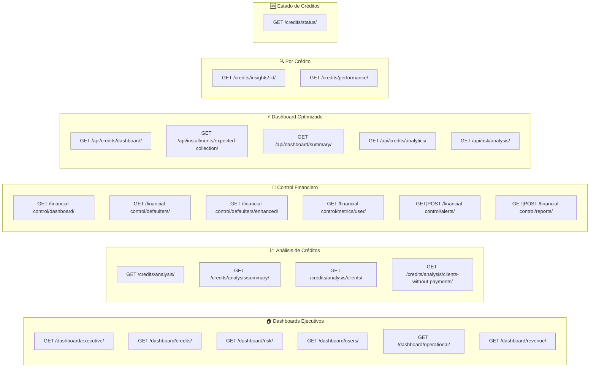

# 📊 Insights API — Guía de Integración Frontend

> **Base URL**: `/api/insights/`
> **Autenticación**: `Authorization: Token <token>` en todos los endpoints.
> **Formato de respuesta**: Todos devuelven `{ success: bool, data: {...}, error?: string }`.

---

## Índice

1. [Convenciones Generales](#convenciones-generales)
2. [Mapa de Endpoints](#mapa-de-endpoints)
3. [Endpoints por Dominio](#endpoints-por-dominio)
   - [A. Dashboards Ejecutivos](#a-dashboards-ejecutivos)
   - [B. Análisis de Créditos](#b-análisis-de-créditos)
   - [C. Control Financiero y Morosos](#c-control-financiero-y-morosos)
   - [D. Dashboard Optimizado (API)](#d-dashboard-optimizado-api)
   - [E. Insights por Crédito Individual](#e-insights-por-crédito-individual)
   - [F. Estado de Créditos (NUEVO)](#f-estado-de-créditos-nuevo)
4. [Ideas de Dashboard y UI](#ideas-de-dashboard-y-ui)
5. [Hooks y Utilidades Sugeridas](#hooks-y-utilidades-sugeridas)

---

## Convenciones Generales

### Formato de Fechas

Siempre usar `YYYY-MM-DD`. Ejemplo: `2026-02-20`.

### Paginación

Los endpoints paginados aceptan:

| Param       | Default | Rango   |
|-------------|---------|---------|
| `page`      | `1`     | ≥ 1     |
| `page_size` | `20`    | 1–100   |

Respuesta de paginación:
```json
{
  "current_page": 1,
  "total_pages": 5,
  "total_count": 96,
  "page_size": 20,
  "has_next": true,
  "has_previous": false,
  "next_page": 2,
  "previous_page": null
}
```

### Permisos

| Icono | Significado |
|-------|-------------|
| 🔓    | `IsAuthenticated` — Cualquier usuario logueado |
| 🔒    | `IsAuthenticated + IsAdminUser` — Solo admin |

### Manejo de Errores

```typescript
interface ApiResponse<T> {
  success: boolean;
  data?: T;
  error?: string;
  parameters?: Record<string, any>;
  filters_applied?: Record<string, any>;
}
```

> [!TIP]
> Siempre verifica `response.success` antes de acceder a `response.data`.

---

## Mapa de Endpoints



---

## Endpoints por Dominio

### A. Dashboards Ejecutivos

---

#### 🔒 `GET /dashboard/executive/`

KPIs principales del negocio. Ideal para la **vista principal** del dashboard.

```typescript
// Response → data
{
  total_credits: number,
  total_amount: number,
  total_pending: number,
  total_collected: number,
  default_rate: number,
  // ... más KPIs del DashboardService
}
```

**UI sugerida**: Tarjetas KPI grandes en la parte superior del dashboard.

---

#### 🔓 `GET /dashboard/credits/?days=30`

Analytics de créditos con métricas de rendimiento.

| Param  | Default | Descripción |
|--------|---------|-------------|
| `days` | `30`    | Periodo de análisis |

---

#### 🔒 `GET /dashboard/risk/`

Métricas de riesgo y morosidad del portafolio.

**UI sugerida**: Gráfico de dona con distribución por nivel de riesgo + gauge del score promedio.

---

#### 🔓 `GET /dashboard/users/`

Insights de comportamiento de usuarios y clientes.

---

#### 🔒 `GET /dashboard/operational/`

Métricas operacionales del negocio.

---

#### 🔒 `GET /dashboard/revenue/`

Analytics de ingresos y ganancias.

**UI sugerida**: Gráfico de líneas con tendencia de ingresos + barras apiladas por categoría.

---

### B. Análisis de Créditos

---

#### 🔒 `GET /credits/analysis/`

Análisis detallado completo: resumen + tabla de clientes + pagos + morosidad.

| Param              | Requerido | Default | Descripción |
|--------------------|-----------|---------|-------------|
| `start_date`       | ✅        | —       | `YYYY-MM-DD` |
| `end_date`         | ✅        | —       | `YYYY-MM-DD` |
| `limit`            | ❌        | todos   | Límite de clientes en tabla |
| `include_payments` | ❌        | `true`  | Incluir análisis de pagos |
| `include_defaults` | ❌        | `true`  | Incluir análisis de morosidad |

```typescript
// Response → data
{
  summary: {
    summary: {
      total_credits: number,
      total_requested: number,
      total_paid: number,
      total_pending: number,
      unique_clients: number,
      clients_without_payments: number,
      clients_in_default: number,
      payment_percentage: number
    }
  },
  clients_table: Array<{
    client_id: number,
    username: string,
    full_name: string,
    total_credits: number,
    total_requested: number,
    total_paid: number,
    total_pending: number,
    payment_percentage: number,
    risk_level: "LOW" | "MEDIUM" | "HIGH"
  }>,
  payments_analysis: {...},
  default_analysis: {...}
}
```

> [!IMPORTANT]
> Este es el endpoint **más completo** para análisis de créditos. Si solo necesitas el resumen, usa `/credits/analysis/summary/`.

---

#### 🔓 `GET /credits/analysis/summary/`

Solo el resumen rápido (sin tabla de clientes ni análisis detallados).

| Param        | Requerido | Descripción |
|--------------|-----------|-------------|
| `start_date` | ✅        | `YYYY-MM-DD` |
| `end_date`   | ✅        | `YYYY-MM-DD` |

---

#### 🔒 `GET /credits/analysis/clients/`

Tabla detallada de clientes con filtros y ordenamiento.

| Param        | Requerido | Default | Descripción |
|--------------|-----------|---------|-------------|
| `start_date` | ✅        | —       | `YYYY-MM-DD` |
| `end_date`   | ✅        | —       | `YYYY-MM-DD` |
| `limit`      | ❌        | todos   | Máximo de clientes |
| `risk_level` | ❌        | todos   | `LOW`, `MEDIUM`, `HIGH` |
| `sort_by`    | ❌        | —       | `total_credits`, `total_requested`, `total_paid`, `total_pending`, `payment_percentage`, `credits_in_default`, `avg_days_overdue` |

```typescript
// Response → data
{
  clients: Array<ClientRow>,
  total_clients: number
}
```

---

#### 🔒 `GET /credits/analysis/clients-without-payments/`

Clientes que no han realizado **ningún pago** en el periodo — ideales para cobranza.

| Param             | Requerido | Default | Descripción |
|-------------------|-----------|---------|-------------|
| `start_date`      | ✅        | —       | `YYYY-MM-DD` |
| `end_date`        | ✅        | —       | `YYYY-MM-DD` |
| `limit`           | ❌        | `100`   | Máx: 500 |
| `sort_by`         | ❌        | —       | `total_requested`, `total_pending`, `days_since_first_credit`, `avg_days_overdue`, `overdue_installments_count` |
| `include_summary` | ❌        | `true`  | Incluir resumen estadístico |

```typescript
// Response → data (con include_summary=true)
{
  clients: Array<ClientRow>,
  total_clients: number,
  summary: {
    total_clients_without_payments: number,
    total_credits: number,
    total_requested_amount: number,
    total_pending_amount: number,
    average_days_overdue: number,
    risk_distribution: { LOW: number, MEDIUM: number, HIGH: number }
  }
}
```

**UI sugerida**: Tabla con indicador visual rojo de urgencia + badge de riesgo + botón "Contactar".

---

### C. Control Financiero y Morosos

---

#### 🔒 `GET /financial-control/dashboard/`

Dashboard consolidado de control financiero.

---

#### 🔒 `GET /financial-control/defaulters/`

Lista paginada de morosos con filtros avanzados.

| Param                | Requerido | Default | Descripción |
|----------------------|-----------|---------|-------------|
| `page`               | ❌        | `1`     | Página actual |
| `page_size`          | ❌        | `20`    | 1–100 |
| `risk_level`         | ❌        | todos   | Nivel de riesgo |
| `min_overdue_amount` | ❌        | —       | Monto mínimo moroso |
| `max_overdue_amount` | ❌        | —       | Monto máximo moroso |
| `min_days_overdue`   | ❌        | —       | Días mínimos en mora |

---

#### 🔒 `GET /financial-control/defaulters/enhanced/`

Insights mejorados de morosos: top 10, distribución de riesgo, potencial de recuperación.

```typescript
// Response → data
{
  summary: {
    total_defaulters: number,
    total_overdue_amount: number,
    new_defaulters_7_days: number,
    default_rate: number
  },
  risk_distribution: Array<{
    risk_level: string,
    count: number,
    total_amount: number,
    avg_days: number
  }>,
  top_defaulters: Array<{
    user: { id: string, username: string, email: string },
    total_overdue_amount: number,
    overdue_credits_count: number,
    days_in_default: number,
    risk_level: string,
    risk_score: number
  }>,
  alerts_by_priority: Array<{ priority: string, count: number }>,
  recovery_potential: {
    high: number,
    medium: number,
    total_recoverable: number
  }
}
```

**UI sugerida**: Panel con 3 columnas → resumen en tarjetas, top morosos en tabla, gauge de potencial de recuperación.

---

#### 🔓 `GET /financial-control/metrics/user/`
#### 🔓 `GET /financial-control/metrics/user/<user_id>/`

Métricas financieras de un usuario específico. Sin `user_id`, devuelve las del usuario autenticado.

---

#### 🔒 `GET /financial-control/alerts/`

Alertas financieras con paginación y filtros.

| Param        | Requerido | Default | Descripción |
|--------------|-----------|---------|-------------|
| `page`       | ❌        | `1`     | Página actual |
| `page_size`  | ❌        | `20`    | 1–100 |
| `status`     | ❌        | todos   | `active`, `acknowledged`, `resolved` |
| `priority`   | ❌        | todos   | `low`, `medium`, `high`, `critical` |
| `alert_type` | ❌        | todos   | `payment_overdue`, `multiple_overdue`, etc. |

#### 🔒 `POST /financial-control/alerts/`

Crear alerta financiera manualmente.

```typescript
// Request body
{
  user_id: number,       // Requerido
  alert_type: string,    // Requerido
  title: string,         // Requerido
  description: string,   // Requerido
  priority: string,      // Opcional, default: "medium"
  alert_data: object     // Opcional, metadata adicional
}
```

---

#### 🔒 `GET /financial-control/reports/` — Listar reportes
#### 🔒 `POST /financial-control/reports/` — Generar nuevo reporte de morosos

---

### D. Dashboard Optimizado (API)

Endpoints optimizados con serializers y paginación de DRF.

---

#### 🔓 `GET /api/credits/dashboard/`

ViewSet paginado de créditos con cálculos optimizados.

| Param      | Default        | Descripción |
|------------|----------------|-------------|
| `page`     | `1`            | Página |
| `ordering` | `-created_at`  | Campo de orden |

---

#### 🔓 `GET /api/installments/expected-collection/`

Cuotas con proyecciones de recaudo esperado.

| Param      | Default    | Descripción |
|------------|------------|-------------|
| `page`     | `1`        | Página |
| `ordering` | `due_date` | Campo de orden |

**UI sugerida**: Calendario con cuotas por cobrar + barra de progreso diaria.

---

#### 🔓 `GET /api/dashboard/summary/`

Métricas calculadas consolidadas del dashboard.

```typescript
// Response → data
{
  credits_summary: {
    total_active_credits: number,
    total_amount_lent: string,
    total_pending_amount: string,
    total_collected: string,
    average_credit_amount: string,
    collection_percentage: number
  },
  installments_summary: {
    due_today: number,
    due_this_week: number,
    overdue_total: number,
    expected_collection_today: string,
    expected_collection_week: string
  },
  performance_metrics: {
    on_time_payment_rate: number,
    average_delay_days: number,
    default_rate: number,
    recovery_rate: number
  },
  by_periodicity: {...},
  alerts: [...]
}
```

---

#### 🔓 `GET /api/credits/analytics/`

Analytics avanzados con agrupaciones.

| Param         | Default | Descripción |
|---------------|---------|-------------|
| `days`        | `30`    | Periodo de análisis |
| `periodicity` | todos   | Filtrar por periodicidad |
| `state`       | todos   | `pending`, `completed`, `checking` |

```typescript
// Response → data
{
  analytics_by_state: Array<{ state: string, count: number, total_amount: number, ... }>,
  analytics_by_periodicity: Array<{ periodicity__name: string, count: number, ... }>,
  analytics_by_subcategory: Array<{ subcategory__name: string, count: number, ... }>,
  temporal_analytics: Array<{ day: string, count: number, total_amount: number }>
}
```

---

#### 🔒 `GET /api/risk/analysis/`

Análisis detallado de riesgo con proyección de pérdidas.

```typescript
// Response → data
{
  risk_by_morosidad: Array<{ morosidad_level: string, count: number, ... }>,
  high_risk_credits_count: number,
  overdue_analysis: Array<{...}>,
  potential_losses: string,
  risk_alerts: [...]
}
```

---

### E. Insights por Crédito Individual

---

#### 🔓 `GET /credits/insights/<credit_uid>/`

Insights detallados de un crédito específico. El usuario ve solo sus créditos; admin ve todos.

```typescript
// Response → data
{
  basic_info: {...},
  payment_analysis: {...},
  risk_evaluation: {...},
  performance_metrics: {...},
  installments_breakdown: {...},
  temporal_analysis: {...},
  comparative_analysis: {...},
  recommendations: [...]
}
```

**UI sugerida**: Modal/drawer lateral con tabs para cada sección cuando el usuario hace click en una fila.

---

#### 🔒 `GET /credits/performance/`

Métricas de rendimiento de créditos por periodo.

| Param         | Default | Opciones |
|---------------|---------|----------|
| `period`      | `30d`   | `7d`, `30d`, `90d`, `1y` |
| `metric_type` | `all`   | `collection`, `risk`, `performance` |

---

### F. Estado de Créditos (NUEVO)

---

#### 🔒 `GET /credits/status/`

**Vista principal para el listado de créditos con KPIs sincronizados.**

> [!IMPORTANT]
> Los KPIs se recalculan en tiempo real basándose **exclusivamente** en los registros filtrados. Al cambiar el seller o las fechas, los KPIs cambian automáticamente.

| Param       | Requerido | Default      | Descripción |
|-------------|-----------|--------------|-------------|
| `date_from` | ❌        | -30 días     | `YYYY-MM-DD` |
| `date_to`   | ❌        | hoy          | `YYYY-MM-DD` |
| `seller`    | ❌        | todos        | `Seller.id` (del dropdown) |
| `page`      | ❌        | `1`          | Página actual |
| `page_size` | ❌        | `20`         | 1–100 |

```typescript
// Response completa
{
  success: true,
  data: {
    kpis: {
      ganancias_periodo: 1500000.00,   // Sum(earnings)
      total_creditos: 25000000.00,     // Sum(price)
      total_cobros: 18000000.00,       // Sum(total_abonos)
      total_pendiente: 7000000.00,     // Sum(pending_amount)
      clientes_unicos: 42,             // Count(user, distinct)
      cantidad_creditos: 85,           // Count(id)
      estado_cuenta: 7000000.00        // total_creditos - total_cobros
    },
    credits: Array<{
      uid: string,
      state: string,
      created_at: string,
      user_id: number,
      user_full_name: string,
      user_username: string,
      seller_id: number | null,
      seller_name: string | null,
      cost: number,
      price: number,
      earnings: number,
      interest: number,
      total_abonos: number,
      pending_amount: number,
      percentage_paid: number,
      first_date_payment: string,
      second_date_payment: string,
      credit_days: number,
      morosidad_level: string,
      is_in_default: boolean,
      subcategory_name: string | null,
      periodicity_name: string | null,
      currency: string
    }>,
    pagination: PaginationMeta,
    available_sellers: Array<{
      id: number,
      name: string,
      credits_count: number
    }>
  },
  filters_applied: {
    date_from: "2026-01-01",
    date_to: "2026-02-20",
    seller: 3,
    page: 1,
    page_size: 20
  }
}
```

---

## Ideas de Dashboard y UI

> [!NOTE]
> Estas ideas son para **complementar y mejorar** lo que ya existe, **no para reemplazarlo**. Incorpora las nuevas secciones en el layout actual.

### 1. Layout General Recomendado

```
┌──────────────────────────────────────────────────────────┐
│  🎛️ Filtros globales: [Date Range Picker] [Seller ▾]     │
├──────────────────────────────────────────────────────────┤
│  📊 KPI Cards (4–6 tarjetas horizontales)                │
│  ┌──────┐ ┌──────┐ ┌──────┐ ┌──────┐ ┌──────┐ ┌──────┐ │
│  │Ganan.│ │Créd. │ │Cobros│ │Pend. │ │Client│ │Balanc│ │
│  │$1.5M │ │$25M  │ │$18M  │ │$7M   │ │42    │ │$7M   │ │
│  └──────┘ └──────┘ └──────┘ └──────┘ └──────┘ └──────┘ │
├──────────────────────────────────────────────────────────┤
│  📈 Gráficos (2 columnas)                                │
│  ┌─────────────────────┐ ┌─────────────────────┐        │
│  │ Tendencia temporal   │ │ Distribución riesgo  │        │
│  │ (Line Chart)         │ │ (Donut Chart)        │        │
│  └─────────────────────┘ └─────────────────────┘        │
├──────────────────────────────────────────────────────────┤
│  📋 Tabla de créditos (paginada, sorteable)              │
│  ┌──────────────────────────────────────────────────────┐│
│  │ Cliente │ Monto │ Pagado │ Pend. │ Estado │ Riesgo  ││
│  │─────────│───────│────────│───────│────────│─────────││
│  │ Juan P. │ $500K │ $300K  │ $200K │ ██░░░  │ 🟡 MED  ││
│  └──────────────────────────────────────────────────────┘│
└──────────────────────────────────────────────────────────┘
```

### 2. KPI Cards — Diseño Premium

```typescript
// Componente sugerido
interface KPICard {
  label: string;           // "Ganancias del periodo"
  value: number;           // 1500000
  format: 'currency' | 'number' | 'percentage';
  icon: string;            // "💰" o un ícono de Lucide/HeroIcons
  trend?: {
    value: number;         // +12.5 (vs periodo anterior)
    direction: 'up' | 'down';
  };
  color: string;           // "emerald" | "blue" | "amber" | "red"
}
```

**Mejoras al diseño actual:**
- Agrega un **sparkline** dentro de cada tarjeta mostrando la tendencia de los últimos 7 días
- Usa colores semánticos: verde = positivo, rojo = riesgo, azul = neutral
- Animación: counter que sube de 0 al valor real al cargar (`framer-motion` o `CountUp.js`)

### 3. Tabla Robusta

**Funcionalidades que debes agregar si no las tienes:**

| Feature | Implementación |
|---------|---------------|
| **Server-side pagination** | `page` + `page_size` params |
| **Sorting por columna** | Click en header → reenviar request con `sort_by` |
| **Filtros inline** | Dropdowns en headers para estado, riesgo |
| **Barra de búsqueda** | Filtro local por nombre de cliente |
| **Export CSV** | Usar `GET /export/` con los mismos filtros |
| **Row expansion** | Click en fila → llamar `/credits/insights/<uid>/` |
| **Status badges** | Chips con colores: `on_time` = verde, `mild_default` = amarillo, `severe_default` = rojo |
| **Progress bar** | Barra visual inline para `percentage_paid` |
| **Sticky header** | Header de tabla fijo al hacer scroll |

### 4. Gráficos Recomendados

| Gráfico | Fuente de datos | Librería |
|---------|-----------------|----------|
| **Tendencia de créditos** | `/api/credits/analytics/?days=90` → `temporal_analytics` | Recharts `<AreaChart>` |
| **Distribución de riesgo** | `/api/risk/analysis/` → `risk_by_morosidad` | Recharts `<PieChart>` |
| **Recaudo vs Crédito** | `/credits/status/` → KPIs `total_creditos` vs `total_cobros` | Chart.js bar chart |
| **Top morosos** | `/financial-control/defaulters/enhanced/` → `top_defaulters` | Recharts `<BarChart>` horizontal |
| **Calendario de cobros** | `/api/installments/expected-collection/` | `react-calendar-heatmap` |
| **Performance por seller** | `/credits/status/?seller=X` (iterar sellers) | Table + sparklines |

### 5. Flujo de Datos Recomendado

```typescript
// hooks/useInsightsDashboard.ts
function useInsightsDashboard() {
  const [filters, setFilters] = useState({
    dateFrom: formatDate(subDays(new Date(), 30)),
    dateTo: formatDate(new Date()),
    seller: null as number | null,
  });

  // ① KPIs + Tabla (sincronizados)
  const { data: statusData, isLoading } = useSWR(
    buildUrl('/api/insights/credits/status/', filters),
    fetcher
  );

  // ② Analytics para gráficos (se actualiza con fechas)
  const { data: analytics } = useSWR(
    `/api/insights/api/credits/analytics/?days=${daysDiff(filters)}`,
    fetcher
  );

  // ③ Riesgo (se actualiza menos frecuentemente)
  const { data: riskData } = useSWR(
    '/api/insights/api/risk/analysis/',
    fetcher,
    { refreshInterval: 60000 }  // refrescar cada minuto
  );

  return {
    kpis: statusData?.data?.kpis,
    credits: statusData?.data?.credits,
    pagination: statusData?.data?.pagination,
    sellers: statusData?.data?.available_sellers,
    analytics: analytics?.data,
    risk: riskData?.data,
    filters,
    setFilters,
    isLoading,
  };
}
```

### 6. Componentes UI Sugeridos

```
src/
├── components/
│   ├── dashboard/
│   │   ├── KPICardGrid.tsx          ← Grid de 6 tarjetas con KPIs
│   │   ├── KPICard.tsx              ← Tarjeta individual con sparkline
│   │   ├── FilterBar.tsx            ← Date pickers + seller dropdown
│   │   ├── CreditStatusTable.tsx    ← Tabla principal paginada
│   │   ├── RiskDistribution.tsx     ← Donut chart de riesgo
│   │   ├── TemporalTrend.tsx        ← Line chart temporal
│   │   ├── CollectionCalendar.tsx   ← Calendario de cuotas
│   │   └── TopDefaulters.tsx        ← Tabla de top morosos
│   ├── shared/
│   │   ├── StatusBadge.tsx          ← Badge con colores de estado
│   │   ├── ProgressBar.tsx          ← Barra de porcentaje pagado
│   │   ├── CurrencyDisplay.tsx      ← Formato moneda con locale
│   │   └── EmptyState.tsx           ← Estado vacío con ilustración
│   └── modals/
│       └── CreditDetailDrawer.tsx   ← Drawer con insights de crédito
├── hooks/
│   ├── useInsightsDashboard.ts      ← Hook principal
│   ├── useCreditAnalysis.ts         ← Hook para análisis detallado
│   ├── useDefaulters.ts             ← Hook para morosos
│   └── useFinancialAlerts.ts        ← Hook para alertas
└── utils/
    ├── api.ts                       ← Fetch wrapper tipado
    ├── formatters.ts                ← formatCurrency, formatDate, formatPercentage
    └── constants.ts                 ← Colores de riesgo, labels de estado
```

### 7. Micro-Interacciones

| Interacción | Detalle |
|-------------|---------|
| **Hover en KPI Card** | Sombra elevada + tooltip con fórmula de cálculo |
| **Cambio de filtro** | Skeleton shimmer en tabla mientras carga |
| **Cambio de página** | Scroll suave al top de la tabla |
| **Click en fila** | Slide-in drawer con `CreditInsightsView` |
| **Badge de riesgo** | Pulse animation si el nivel es `critical` |
| **Números** | CountUp animation en KPIs al renderizar |
| **Filtro de seller** | Autocomplete con chip que muestra `credits_count` |

### 8. Páginas Sugeridas

| Página | Endpoints que consume | Descripción |
|--------|----------------------|-------------|
| `/dashboard` (principal) | `dashboard/summary/` + `credits/status/` | KPIs + tabla rápida |
| `/credits` (completa) | `credits/status/` + `credits/analytics/` | Tabla completa con gráficos |
| `/risk` | `risk/analysis/` + `defaulters/enhanced/` + `credits/table/` | Panel de riesgo |
| `/collections` | `installments/expected-collection/` + `clients-without-payments/` | Cobranza |
| `/credit/:id` | `credits/insights/:id/` | Detalle individual |
| `/alerts` | `financial-control/alerts/` | Centro de alertas |

---

## Hooks y Utilidades Sugeridas

### Fetch Wrapper Tipado

```typescript
// utils/api.ts
const BASE = '/api/insights';

export async function insightsFetch<T>(
  endpoint: string,
  params?: Record<string, any>
): Promise<ApiResponse<T>> {
  const url = new URL(`${BASE}${endpoint}`, window.location.origin);

  if (params) {
    Object.entries(params).forEach(([key, val]) => {
      if (val !== null && val !== undefined) {
        url.searchParams.set(key, String(val));
      }
    });
  }

  const res = await fetch(url.toString(), {
    headers: {
      'Authorization': `Token ${getToken()}`,
      'Content-Type': 'application/json',
    },
  });

  return res.json();
}

// Uso:
const data = await insightsFetch<CreditStatusResponse>('/credits/status/', {
  date_from: '2026-01-01',
  date_to: '2026-02-20',
  seller: 3,
});
```

### Formateadores

```typescript
// utils/formatters.ts
export function formatCurrency(value: number, currency = 'COP'): string {
  return new Intl.NumberFormat('es-CO', {
    style: 'currency',
    currency,
    minimumFractionDigits: 0,
    maximumFractionDigits: 0,
  }).format(value);
}

export function formatPercentage(value: number): string {
  return `${value.toFixed(1)}%`;
}

// Colores de riesgo
export const RISK_COLORS = {
  on_time:           { bg: '#10b981', label: 'Al día' },
  mild_default:      { bg: '#f59e0b', label: 'Leve' },
  moderate_default:  { bg: '#f97316', label: 'Moderado' },
  severe_default:    { bg: '#ef4444', label: 'Severo' },
  recurrent_default: { bg: '#dc2626', label: 'Recurrente' },
  critical_default:  { bg: '#991b1b', label: 'Crítico' },
} as const;

---

## Solución de Problemas Comunes

### El filtro de Seller solo muestra un usuario (ej. "admin" o "lorena")

**Causa**: Estás usando el campo `registered_by` en lugar de `seller`.
- `registered_by`: Es el usuario que *creó* el registro en el sistema (muchas veces es la misma secretaria o admin para todos los créditos).
- `seller`: Es el vendedor real asignado al crédito.

**Solución**:
1. En `/credits/status/`, usa exclusivamente `data.available_sellers` para el dropdown.
2. En las filas de la tabla, usa `seller_name` y `seller_id`.
3. Asegúrate de enviar el parámetro `?seller=ID` (donde ID es el PK del vendedor).

---

> [!CAUTION]
> **No elimines** componentes o páginas que ya funcionan. Todos los endpoints existentes siguen activos. Complementa con los nuevos y mejora la UX de lo que ya tienes.
```
