# ESPECIFICACIONES TÉCNICAS - SISTEMA CONTABLE Y POS PARA FINTECH

## 📋 **RESUMEN EJECUTIVO**

Este documento describe la implementación de un **sistema contable independiente** y **sistema POS** para la fintech, basado en las mejores prácticas de ERPNext, que permitirá:

1. **Conciliación automática** entre sistema operacional y contable
2. **Puntos de venta** para cobradores/cajeros con auditoría completa
3. **Determinación de fecha de corte** para clientes con inconsistencias
4. **Reportes de validación** en tiempo real

---

## 🎯 **OBJETIVOS**

### **Objetivos Principales**
- Implementar sistema contable independiente que cumpla con Plan de Cuentas Panamá
- Crear sistema POS para cobradores con conciliación automática
- Establecer fecha de corte para clientes con inconsistencias
- Garantizar integridad financiera y auditoría completa

### **Objetivos Técnicos**
- Mantener sistema existente sin interrupciones
- Crear aplicación contable independiente
- Implementar sincronización automática
- Desarrollar dashboard de conciliación

---

## 🏗️ **ARQUITECTURA DEL SISTEMA**

### **1. ESTRUCTURA DE APLICACIONES**

```
apps/
├── fintech/           # Sistema existente (NO MODIFICAR)
│   ├── models.py      # User, Credit, Transaction, etc.
│   ├── services/      # Servicios existentes
│   └── ...
├── accounting/        # NUEVA: Sistema contable independiente
│   ├── models.py      # ChartOfAccounts, GLEntry, CustomerAccount
│   ├── services/      # AccountingService, ReconciliationService
│   └── ...
└── pos/              # NUEVA: Sistema POS para cobradores
    ├── models.py      # POSProfile, POSSession, POSInvoice
    ├── services/      # POSService, POSReconciliationService
    └── ...
```

### **2. FLUJO DE DATOS**

```mermaid
graph TD
    A[Sistema Fintech Existente] --> B[Sincronización Automática]
    B --> C[Sistema Contable Independiente]
    B --> D[Sistema POS]
    C --> E[Conciliación y Validación]
    D --> E
    E --> F[Reportes y Dashboard]
```



---

## 📊 **ESPECIFICACIONES TÉCNICAS DETALLADAS**

### **1. SISTEMA CONTABLE INDEPENDIENTE**

#### **1.1 Modelos Contables**

```python
# apps/accounting/models.py

class ChartOfAccounts(models.Model):
    """
    Catálogo de Cuentas Contables - Plan de Cuentas Panamá
    """
    ACCOUNT_TYPES = [
        ('1', 'ACTIVO'),
        ('2', 'PASIVO'),
        ('3', 'PATRIMONIO'),
        ('4', 'INGRESOS'),
        ('5', 'GASTOS'),
    ]
    
    # Campos principales
    code = models.CharField(max_length=20, unique=True, db_index=True)
    name = models.CharField(max_length=200)
    account_type = models.CharField(max_length=1, choices=ACCOUNT_TYPES)
    parent = models.ForeignKey('self', on_delete=models.CASCADE, null=True, blank=True)
    level = models.PositiveIntegerField(default=0)
    is_group = models.BooleanField(default=False)
    is_active = models.BooleanField(default=True)
    is_system = models.BooleanField(default=False)
    
    # Propiedades específicas
    is_customer = models.BooleanField(default=False)
    is_supplier = models.BooleanField(default=False)
    is_employee = models.BooleanField(default=False)
    is_bank = models.BooleanField(default=False)
    
    # Metadatos
    created_at = models.DateTimeField(auto_now_add=True)
    updated_at = models.DateTimeField(auto_now=True)
    created_by = models.ForeignKey('auth.User', on_delete=models.SET_NULL, null=True)

class GLEntry(models.Model):
    """
    Entradas del Libro Mayor - Doble Partida Contable
    """
    uid = models.UUIDField(default=uuid.uuid4, editable=False, unique=True)
    account = models.ForeignKey(ChartOfAccounts, on_delete=models.PROTECT, related_name='gle_entries')
    
    # Montos
    debit = models.DecimalField(max_digits=15, decimal_places=2, default=0)
    credit = models.DecimalField(max_digits=15, decimal_places=2, default=0)
    
    # Referencias al sistema fintech (OPCIONAL)
    fintech_credit_id = models.IntegerField(null=True, blank=True)
    fintech_transaction_id = models.IntegerField(null=True, blank=True)
    fintech_installment_id = models.IntegerField(null=True, blank=True)
    
    # Voucher
    voucher_type = models.CharField(max_length=50)
    voucher_no = models.CharField(max_length=100, db_index=True)
    posting_date = models.DateField(db_index=True)
    created_at = models.DateTimeField(auto_now_add=True)
    
    # Usuario y centro de costos
    created_by = models.ForeignKey('auth.User', on_delete=models.SET_NULL, null=True)
    cost_center = models.CharField(max_length=100, null=True, blank=True)
    
    # Metadatos
    description = models.TextField(null=True, blank=True)
    reference = models.CharField(max_length=200, null=True, blank=True)

class CustomerAccount(models.Model):
    """
    Cuenta Corriente del Cliente - Sistema Independiente
    """
    uid = models.UUIDField(default=uuid.uuid4, editable=False, unique=True)
    account_number = models.CharField(max_length=20, unique=True)
    
    # Referencia al sistema fintech (OPCIONAL)
    fintech_user_id = models.IntegerField(null=True, blank=True)
    
    # Saldos
    current_balance = models.DecimalField(max_digits=15, decimal_places=2, default=0)
    credit_limit = models.DecimalField(max_digits=15, decimal_places=2, default=0)
    available_credit = models.DecimalField(max_digits=15, decimal_places=2, default=0)
    
    # Estado
    is_active = models.BooleanField(default=True)
    is_blocked = models.BooleanField(default=False)
    
    # Fecha de corte para clientes con inconsistencias
    cutoff_date = models.DateField(null=True, blank=True)
    cutoff_reason = models.TextField(null=True, blank=True)
    
    # Metadatos
    created_at = models.DateTimeField(auto_now_add=True)
    updated_at = models.DateTimeField(auto_now=True)
```

#### **1.2 Servicios Contables**

```python
# apps/accounting/services/accounting_service.py

class AccountingService:
    """
    Servicio principal para operaciones contables
    """
    
    @staticmethod
    def create_credit_entries(credit):
        """
        Crear entradas contables cuando se otorga un crédito
        """
        with db_transaction.atomic():
            # Obtener cuentas del catálogo
            customer_account = ChartOfAccounts.objects.get(code='1200')
            cash_account = ChartOfAccounts.objects.get(code='1100')
            
            # Crear entradas
            GLEntry.objects.create(
                account=customer_account,
                debit=credit.price,
                voucher_type='Credit',
                voucher_no=str(credit.uid),
                posting_date=credit.created_at.date(),
                fintech_credit_id=credit.id,
                description=f"Crédito a {credit.user.username}"
            )
            
            GLEntry.objects.create(
                account=cash_account,
                credit=credit.price,
                voucher_type='Credit',
                voucher_no=str(credit.uid),
                posting_date=credit.created_at.date(),
                fintech_credit_id=credit.id,
                description=f"Crédito a {credit.user.username}"
            )
            
            # Actualizar cuenta del usuario
            user_account, created = CustomerAccount.objects.get_or_create(
                fintech_user_id=credit.user.id,
                defaults={'account_number': f"ACC-{credit.user.id}"}
            )
            
            user_account.update_balance(
                amount=credit.price,
                movement_type='credit_granted',
                description=f"Crédito otorgado - {credit.price}"
            )

class ReconciliationService:
    """
    Servicio para conciliar sistema fintech con contabilidad
    """
    
    @staticmethod
    def reconcile_credits_by_period(start_date, end_date):
        """
        Conciliar créditos por período
        """
        # Obtener créditos del sistema fintech
        from apps.fintech.models import Credit
        fintech_credits = Credit.objects.filter(
            created_at__date__range=[start_date, end_date]
        )
        
        # Obtener entradas contables
        accounting_entries = GLEntry.objects.filter(
            posting_date__range=[start_date, end_date],
            voucher_type='Credit'
        )
        
        # Comparar totales
        fintech_total = sum(credit.price for credit in fintech_credits)
        accounting_total = sum(entry.debit for entry in accounting_entries)
        
        return {
            'fintech_total': fintech_total,
            'accounting_total': accounting_total,
            'difference': fintech_total - accounting_total,
            'is_balanced': fintech_total == accounting_total
        }
    
    @staticmethod
    def reconcile_customer_balance(customer_id):
        """
        Conciliar saldo por cliente
        """
        # Obtener cuenta del cliente en fintech
        from apps.fintech.models import User
        try:
            fintech_user = User.objects.get(id=customer_id)
            fintech_credits = fintech_user.credits.all()
            fintech_payments = fintech_user.transactions.filter(
                transaction_type='income', status='confirmed'
            )
            
            # Calcular saldo fintech
            total_credits = sum(credit.price for credit in fintech_credits)
            total_payments = sum(t.amount for t in fintech_payments)
            fintech_balance = total_credits - total_payments
            
            # Obtener cuenta contable
            try:
                accounting_account = CustomerAccount.objects.get(fintech_user_id=customer_id)
                accounting_balance = accounting_account.current_balance
            except CustomerAccount.DoesNotExist:
                accounting_balance = 0
            
            return {
                'customer_id': customer_id,
                'fintech_balance': fintech_balance,
                'accounting_balance': accounting_balance,
                'difference': fintech_balance - accounting_balance,
                'is_balanced': fintech_balance == accounting_balance
            }
            
        except User.DoesNotExist:
            return {'error': 'Cliente no encontrado'}
```

### **2. SISTEMA POS PARA COBRADORES**

#### **2.1 Modelos POS**

```python
# apps/pos/models.py

class POSProfile(models.Model):
    """
    Perfil de Punto de Venta - Basado en ERPNext POS Profile
    """
    name = models.CharField(max_length=100, unique=True)
    user = models.OneToOneField('auth.User', on_delete=models.CASCADE, related_name='pos_profile')
    
    # Configuración de caja
    default_cash_account = models.ForeignKey('accounting.ChartOfAccounts', on_delete=models.PROTECT, related_name='pos_cash_accounts')
    default_customer_account = models.ForeignKey('accounting.ChartOfAccounts', on_delete=models.PROTECT, related_name='pos_customer_accounts')
    
    # Límites y permisos
    max_daily_amount = models.DecimalField(max_digits=15, decimal_places=2, default=10000)
    max_transaction_amount = models.DecimalField(max_digits=15, decimal_places=2, default=1000)
    
    # Estado
    is_active = models.BooleanField(default=True)
    is_online = models.BooleanField(default=False)
    
    # Metadatos
    created_at = models.DateTimeField(auto_now_add=True)
    updated_at = models.DateTimeField(auto_now=True)

class POSSession(models.Model):
    """
    Sesión de Punto de Venta - Basado en ERPNext POS Opening Entry
    """
    SESSION_STATUS = [
        ('open', 'Abierta'),
        ('closed', 'Cerrada'),
        ('suspended', 'Suspendida'),
    ]
    
    uid = models.UUIDField(default=uuid.uuid4, editable=False, unique=True)
    pos_profile = models.ForeignKey(POSProfile, on_delete=models.CASCADE, related_name='sessions')
    
    # Fechas
    opening_time = models.DateTimeField(auto_now_add=True)
    closing_time = models.DateTimeField(null=True, blank=True)
    
    # Saldos
    opening_balance = models.DecimalField(max_digits=15, decimal_places=2, default=0)
    closing_balance = models.DecimalField(max_digits=15, decimal_places=2, null=True, blank=True)
    expected_balance = models.DecimalField(max_digits=15, decimal_places=2, default=0)
    
    # Estado
    status = models.CharField(max_length=20, choices=SESSION_STATUS, default='open')
    
    # Metadatos
    created_by = models.ForeignKey('auth.User', on_delete=models.SET_NULL, null=True)

class POSInvoice(models.Model):
    """
    Factura POS - Basado en ERPNext POS Invoice
    """
    INVOICE_STATUS = [
        ('draft', 'Borrador'),
        ('submitted', 'Enviada'),
        ('paid', 'Pagada'),
        ('cancelled', 'Cancelada'),
    ]
    
    uid = models.UUIDField(default=uuid.uuid4, editable=False, unique=True)
    session = models.ForeignKey(POSSession, on_delete=models.CASCADE, related_name='invoices')
    
    # Cliente y crédito
    customer = models.ForeignKey('fintech.User', on_delete=models.CASCADE, related_name='pos_invoices')
    credit = models.ForeignKey('fintech.Credit', on_delete=models.CASCADE, related_name='pos_invoices')
    
    # Montos
    subtotal = models.DecimalField(max_digits=15, decimal_places=2)
    tax_amount = models.DecimalField(max_digits=15, decimal_places=2, default=0)
    discount_amount = models.DecimalField(max_digits=15, decimal_places=2, default=0)
    grand_total = models.DecimalField(max_digits=15, decimal_places=2)
    
    # Estado
    status = models.CharField(max_length=20, choices=INVOICE_STATUS, default='draft')
    
    # Metadatos
    created_at = models.DateTimeField(auto_now_add=True)
    updated_at = models.DateTimeField(auto_now=True)
    created_by = models.ForeignKey('auth.User', on_delete=models.SET_NULL, null=True)

class POSPayment(models.Model):
    """
    Pago POS - Basado en ERPNext POS Payment
    """
    PAYMENT_METHODS = [
        ('cash', 'Efectivo'),
        ('card', 'Tarjeta'),
        ('transfer', 'Transferencia'),
        ('check', 'Cheque'),
    ]
    
    invoice = models.ForeignKey(POSInvoice, on_delete=models.CASCADE, related_name='payments')
    payment_method = models.CharField(max_length=20, choices=PAYMENT_METHODS)
    amount = models.DecimalField(max_digits=15, decimal_places=2)
    
    # Referencia al sistema fintech
    fintech_transaction = models.ForeignKey('fintech.Transaction', on_delete=models.SET_NULL, null=True, blank=True)
    
    # Metadatos
    created_at = models.DateTimeField(auto_now_add=True)
    created_by = models.ForeignKey('auth.User', on_delete=models.SET_NULL, null=True)
```

#### **2.2 Servicios POS**

```python
# apps/pos/services/pos_service.py

class POSService:
    """
    Servicio principal para operaciones POS
    Basado en funcionalidades de ERPNext
    """
    
    @staticmethod
    def open_session(user, opening_balance):
        """
        Abrir sesión POS - Basado en ERPNext POS Opening Entry
        """
        try:
            pos_profile = POSProfile.objects.get(user=user, is_active=True)
            
            # Verificar si hay sesión abierta
            if POSSession.objects.filter(pos_profile=pos_profile, status='open').exists():
                return False, "Ya existe una sesión abierta"
            
            # Crear nueva sesión
            session = POSSession.objects.create(
                pos_profile=pos_profile,
                opening_balance=opening_balance,
                created_by=user
            )
            
            # Crear entradas contables de apertura
            session.create_opening_entries()
            
            return True, f"Sesión abierta exitosamente. ID: {session.uid}"
            
        except POSProfile.DoesNotExist:
            return False, "Perfil POS no encontrado"
    
    @staticmethod
    def create_invoice(session, customer, credit, payment_method, amount):
        """
        Crear factura POS - Basado en ERPNext POS Invoice
        """
        try:
            # Verificar sesión abierta
            if session.status != 'open':
                return False, "Sesión no está abierta"
            
            # Crear factura
            invoice = POSInvoice.objects.create(
                session=session,
                customer=customer,
                credit=credit,
                subtotal=amount,
                grand_total=amount,
                created_by=session.pos_profile.user
            )
            
            # Crear pago
            payment = POSPayment.objects.create(
                invoice=invoice,
                payment_method=payment_method,
                amount=amount,
                created_by=session.pos_profile.user
            )
            
            # Crear transacción en sistema fintech
            from apps.fintech.models import Transaction
            transaction = Transaction.objects.create(
                transaction_type='income',
                user=customer,
                status='confirmed',
                description=f"Pago POS - Factura {invoice.uid}",
                source='pos'
            )
            
            # Vincular pago con transacción
            payment.fintech_transaction = transaction
            payment.save()
            
            # Crear entradas contables
            invoice.create_accounting_entries()
            
            return True, f"Factura creada: {invoice.uid}"
            
        except Exception as e:
            return False, f"Error creando factura: {str(e)}"
    
    @staticmethod
    def close_session(session, actual_balance):
        """
        Cerrar sesión POS - Basado en ERPNext POS Closing Entry
        """
        try:
            if session.status != 'open':
                return False, "Sesión no está abierta"
            
            # Cerrar sesión
            session.close_session(actual_balance)
            
            # Crear entradas contables de cierre
            session.create_closing_entries()
            
            return True, f"Sesión cerrada exitosamente. Saldo esperado: {session.expected_balance}, Saldo real: {session.closing_balance}"
            
        except Exception as e:
            return False, f"Error cerrando sesión: {str(e)}"
    
    @staticmethod
    def reconcile_session(session):
        """
        Conciliar sesión POS - Basado en ERPNext reconciliation
        """
        try:
            # Calcular saldo esperado
            expected_balance = session.get_expected_balance()
            actual_balance = session.closing_balance or 0
            
            # Calcular diferencia
            difference = actual_balance - expected_balance
            
            # Crear reporte de conciliación
            reconciliation_report = {
                'session_id': session.uid,
                'opening_balance': session.opening_balance,
                'total_sales': session.get_total_sales(),
                'total_cash': session.get_total_cash(),
                'expected_balance': expected_balance,
                'actual_balance': actual_balance,
                'difference': difference,
                'is_balanced': difference == 0,
                'status': 'balanced' if difference == 0 else 'unbalanced'
            }
            
            return True, reconciliation_report
            
        except Exception as e:
            return False, f"Error en conciliación: {str(e)}"
```

### **3. DETERMINACIÓN DE FECHA DE CORTE**

#### **3.1 Servicio de Análisis de Inconsistencias**

```python
# apps/accounting/services/cutoff_service.py

class CutoffService:
    """
    Servicio para determinar fecha de corte de clientes con inconsistencias
    """
    
    @staticmethod
    def analyze_customer_inconsistencies(customer_id):
        """
        Analizar inconsistencias de un cliente específico
        """
        from apps.fintech.models import User, Credit, Transaction
        
        try:
            customer = User.objects.get(id=customer_id)
            
            # Obtener datos del cliente
            credits = customer.credits.all()
            transactions = customer.transactions.filter(status='confirmed')
            
            # Calcular saldo según sistema fintech
            total_credits = sum(credit.price for credit in credits)
            total_payments = sum(t.amount for t in transactions)
            fintech_balance = total_credits - total_payments
            
            # Obtener cuenta contable
            try:
                accounting_account = CustomerAccount.objects.get(fintech_user_id=customer_id)
                accounting_balance = accounting_account.current_balance
            except CustomerAccount.DoesNotExist:
                accounting_balance = 0
            
            # Calcular diferencia
            difference = fintech_balance - accounting_balance
            
            # Determinar si hay inconsistencias
            has_inconsistencies = abs(difference) > 0.01  # Tolerancia de 1 centavo
            
            return {
                'customer_id': customer_id,
                'customer_name': customer.username,
                'fintech_balance': fintech_balance,
                'accounting_balance': accounting_balance,
                'difference': difference,
                'has_inconsistencies': has_inconsistencies,
                'total_credits': total_credits,
                'total_payments': total_payments,
                'credits_count': credits.count(),
                'transactions_count': transactions.count()
            }
            
        except User.DoesNotExist:
            return {'error': 'Cliente no encontrado'}
    
    @staticmethod
    def determine_cutoff_date(customer_id, analysis_date=None):
        """
        Determinar fecha de corte para un cliente con inconsistencias
        """
        if analysis_date is None:
            analysis_date = timezone.now().date()
        
        from apps.fintech.models import User, Credit, Transaction
        
        try:
            customer = User.objects.get(id=customer_id)
            
            # Obtener cuenta contable
            try:
                accounting_account = CustomerAccount.objects.get(fintech_user_id=customer_id)
            except CustomerAccount.DoesNotExist:
                # Crear cuenta si no existe
                accounting_account = CustomerAccount.objects.create(
                    fintech_user_id=customer_id,
                    account_number=f"ACC-{customer_id}"
                )
            
            # Analizar transacciones por fecha
            cutoff_analysis = []
            
            # Obtener todas las fechas con transacciones
            credit_dates = Credit.objects.filter(user=customer).values_list('created_at__date', flat=True).distinct()
            transaction_dates = Transaction.objects.filter(user=customer, status='confirmed').values_list('date__date', flat=True).distinct()
            
            all_dates = sorted(set(list(credit_dates) + list(transaction_dates)))
            
            for date in all_dates:
                # Calcular saldo hasta esa fecha
                credits_until_date = Credit.objects.filter(
                    user=customer,
                    created_at__date__lte=date
                ).aggregate(total=models.Sum('price'))['total'] or 0
                
                transactions_until_date = Transaction.objects.filter(
                    user=customer,
                    date__date__lte=date,
                    status='confirmed'
                ).aggregate(total=models.Sum('amount'))['total'] or 0
                
                balance_until_date = credits_until_date - transactions_until_date
                
                cutoff_analysis.append({
                    'date': date,
                    'credits_total': credits_until_date,
                    'payments_total': transactions_until_date,
                    'balance': balance_until_date
                })
            
            # Encontrar la fecha con menor diferencia
            min_difference = float('inf')
            best_cutoff_date = None
            
            for analysis in cutoff_analysis:
                difference = abs(analysis['balance'] - accounting_account.current_balance)
                if difference < min_difference:
                    min_difference = difference
                    best_cutoff_date = analysis['date']
            
            return {
                'customer_id': customer_id,
                'analysis_date': analysis_date,
                'best_cutoff_date': best_cutoff_date,
                'min_difference': min_difference,
                'current_accounting_balance': accounting_account.current_balance,
                'cutoff_analysis': cutoff_analysis
            }
            
        except User.DoesNotExist:
            return {'error': 'Cliente no encontrado'}
    
    @staticmethod
    def set_customer_cutoff_date(customer_id, cutoff_date, reason):
        """
        Establecer fecha de corte para un cliente
        """
        try:
            accounting_account = CustomerAccount.objects.get(fintech_user_id=customer_id)
            accounting_account.cutoff_date = cutoff_date
            accounting_account.cutoff_reason = reason
            accounting_account.save()
            
            return True, f"Fecha de corte establecida: {cutoff_date}"
            
        except CustomerAccount.DoesNotExist:
            return False, "Cuenta contable del cliente no encontrada"
    
    @staticmethod
    def get_customers_with_inconsistencies():
        """
        Obtener lista de clientes con inconsistencias
        """
        customers_with_issues = []
        
        # Obtener todos los clientes con cuentas contables
        accounting_accounts = CustomerAccount.objects.filter(is_active=True)
        
        for account in accounting_accounts:
            analysis = CutoffService.analyze_customer_inconsistencies(account.fintech_user_id)
            
            if analysis.get('has_inconsistencies', False):
                customers_with_issues.append(analysis)
        
        return customers_with_issues
```

#### **3.2 API para Gestión de Fechas de Corte**

```python
# apps/accounting/views.py

class CutoffViewSet(viewsets.ViewSet):
    
    @action(detail=False, methods=['get'])
    def analyze_customer(self, request):
        """
        Analizar inconsistencias de un cliente
        """
        customer_id = request.query_params.get('customer_id')
        
        if not customer_id:
            return Response({'error': 'customer_id es requerido'}, status=400)
        
        analysis = CutoffService.analyze_customer_inconsistencies(customer_id)
        
        return Response(analysis)
    
    @action(detail=False, methods=['get'])
    def determine_cutoff_date(self, request):
        """
        Determinar fecha de corte para un cliente
        """
        customer_id = request.query_params.get('customer_id')
        analysis_date = request.query_params.get('analysis_date')
        
        if not customer_id:
            return Response({'error': 'customer_id es requerido'}, status=400)
        
        if analysis_date:
            analysis_date = datetime.strptime(analysis_date, '%Y-%m-%d').date()
        
        result = CutoffService.determine_cutoff_date(customer_id, analysis_date)
        
        return Response(result)
    
    @action(detail=False, methods=['post'])
    def set_cutoff_date(self, request):
        """
        Establecer fecha de corte para un cliente
        """
        customer_id = request.data.get('customer_id')
        cutoff_date = request.data.get('cutoff_date')
        reason = request.data.get('reason', '')
        
        if not customer_id or not cutoff_date:
            return Response({'error': 'customer_id y cutoff_date son requeridos'}, status=400)
        
        cutoff_date = datetime.strptime(cutoff_date, '%Y-%m-%d').date()
        
        success, message = CutoffService.set_customer_cutoff_date(
            customer_id, cutoff_date, reason
        )
        
        if success:
            return Response({'message': message}, status=200)
        else:
            return Response({'error': message}, status=400)
    
    @action(detail=False, methods=['get'])
    def customers_with_inconsistencies(self, request):
        """
        Obtener lista de clientes con inconsistencias
        """
        customers = CutoffService.get_customers_with_inconsistencies()
        
        return Response({
            'total_customers': len(customers),
            'customers': customers
        })
```

---

## 🔄 **IMPLEMENTACIÓN POR FASES**

### **FASE 1: SISTEMA CONTABLE INDEPENDIENTE (2-3 semanas)**

#### **Semana 1: Modelos y Migraciones**
- [ ] Crear aplicación `accounting`
- [ ] Implementar modelos `ChartOfAccounts`, `GLEntry`, `CustomerAccount`
- [ ] Crear migraciones sin afectar sistema existente
- [ ] Implementar catálogo de cuentas básico (Plan de Cuentas Panamá)

#### **Semana 2: Servicios Contables**
- [ ] Implementar `AccountingService`
- [ ] Implementar `ReconciliationService`
- [ ] Crear signals de sincronización con sistema fintech
- [ ] Tests unitarios para servicios contables

#### **Semana 3: Integración y Validación**
- [ ] Implementar sincronización automática
- [ ] Crear dashboard de conciliación
- [ ] Reportes de validación
- [ ] Tests de integración

### **FASE 2: SISTEMA POS (2-3 semanas)**

#### **Semana 4: Modelos POS**
- [ ] Crear aplicación `pos`
- [ ] Implementar modelos `POSProfile`, `POSSession`, `POSInvoice`, `POSPayment`
- [ ] Crear migraciones
- [ ] Tests básicos

#### **Semana 5: Servicios POS**
- [ ] Implementar `POSService`
- [ ] Entradas contables automáticas
- [ ] Conciliación de sesiones
- [ ] Tests de integración

#### **Semana 6: API y Dashboard**
- [ ] APIs para cobradores
- [ ] Dashboard de conciliación POS
- [ ] Reportes de rendimiento
- [ ] Tests end-to-end

### **FASE 3: GESTIÓN DE INCONSISTENCIAS (1-2 semanas)**

#### **Semana 7: Análisis de Inconsistencias**
- [ ] Implementar `CutoffService`
- [ ] Algoritmo de determinación de fecha de corte
- [ ] APIs para gestión de fechas de corte
- [ ] Tests de análisis

#### **Semana 8: Validación y Optimización**
- [ ] Validación con datos reales
- [ ] Optimización de queries
- [ ] Documentación final
- [ ] Tests de performance

---

## 📊 **REPORTES Y DASHBOARDS**

### **1. Dashboard de Conciliación General**

```python
# apps/accounting/views.py

class ReconciliationDashboardViewSet(viewsets.ViewSet):
    
    @action(detail=False, methods=['get'])
    def daily_summary(self, request):
        """
        Resumen diario de conciliación
        """
        date = request.query_params.get('date', timezone.now().date())
        
        # Conciliación de créditos
        credits_reconciliation = ReconciliationService.reconcile_credits_by_period(date, date)
        
        # Conciliación de clientes
        customers_reconciliation = []
        customers = User.objects.filter(credits__created_at__date=date).distinct()
        
        for customer in customers:
            reconciliation = ReconciliationService.reconcile_customer_balance(customer.id)
            customers_reconciliation.append(reconciliation)
        
        return Response({
            'date': date,
            'credits_reconciliation': credits_reconciliation,
            'customers_reconciliation': customers_reconciliation,
            'total_customers': len(customers_reconciliation),
            'balanced_customers': len([c for c in customers_reconciliation if c.get('is_balanced', False)])
        })
    
    @action(detail=False, methods=['get'])
    def period_reconciliation(self, request):
        """
        Conciliación por período
        """
        start_date = request.query_params.get('start_date')
        end_date = request.query_params.get('end_date')
        
        if not start_date or not end_date:
            return Response({'error': 'start_date y end_date son requeridos'}, status=400)
        
        report = ReconciliationService.generate_reconciliation_report(start_date, end_date)
        
        return Response(report)
```

### **2. Dashboard POS**

```python
# apps/pos/views.py

class POSDashboardViewSet(viewsets.ViewSet):
    
    @action(detail=False, methods=['get'])
    def daily_reconciliation(self, request):
        """
        Conciliación diaria de todos los POS
        """
        date = request.query_params.get('date', timezone.now().date())
        
        # Obtener todas las sesiones del día
        sessions = POSSession.objects.filter(
            opening_time__date=date,
            status='closed'
        )
        
        reconciliation_data = []
        total_expected = 0
        total_actual = 0
        
        for session in sessions:
            success, result = POSService.reconcile_session(session)
            if success:
                reconciliation_data.append(result)
                total_expected += result['expected_balance']
                total_actual += result['actual_balance']
        
        return Response({
            'date': date,
            'sessions': reconciliation_data,
            'summary': {
                'total_expected': total_expected,
                'total_actual': total_actual,
                'total_difference': total_actual - total_expected,
                'is_balanced': total_expected == total_actual
            }
        })
    
    @action(detail=False, methods=['get'])
    def cashier_performance(self, request):
        """
        Rendimiento de cobradores
        """
        start_date = request.query_params.get('start_date')
        end_date = request.query_params.get('end_date')
        
        # Obtener sesiones del período
        sessions = POSSession.objects.filter(
            opening_time__date__range=[start_date, end_date],
            status='closed'
        )
        
        cashier_data = {}
        
        for session in sessions:
            cashier = session.pos_profile.user.username
            if cashier not in cashier_data:
                cashier_data[cashier] = {
                    'total_sales': 0,
                    'total_sessions': 0,
                    'total_differences': 0,
                    'balanced_sessions': 0
                }
            
            cashier_data[cashier]['total_sales'] += session.get_total_sales()
            cashier_data[cashier]['total_sessions'] += 1
            
            success, result = POSService.reconcile_session(session)
            if success:
                cashier_data[cashier]['total_differences'] += result['difference']
                if result['is_balanced']:
                    cashier_data[cashier]['balanced_sessions'] += 1
        
        return Response(cashier_data)
```

---

## 🔧 **CONFIGURACIÓN TÉCNICA**

### **1. Configuración de Base de Datos**

```python
# core/settings.py - AGREGAR

# Configuración de aplicaciones
PROJECT_APPS = [
    'apps.fintech',
    'apps.dashboard',
    'apps.revenue',
    'apps.forecasting',
    'apps.insights',
    'apps.accounting',  # NUEVA
    'apps.pos',         # NUEVA
]

# Configuración de contabilidad
ACCOUNTING_SETTINGS = {
    'DEFAULT_CASH_ACCOUNT': '1100',
    'DEFAULT_CUSTOMER_ACCOUNT': '1200',
    'DEFAULT_INCOME_ACCOUNT': '4100',
    'DEFAULT_EXPENSE_ACCOUNT': '5100',
    'CURRENCY': 'USD',
    'TIMEZONE': 'America/Panama',
}

# Configuración POS
POS_SETTINGS = {
    'MAX_DAILY_AMOUNT': 10000,
    'MAX_TRANSACTION_AMOUNT': 1000,
    'SESSION_TIMEOUT': 8,  # horas
    'AUTO_CLOSE_SESSIONS': True,
}
```

### **2. URLs y Routing**

```python
# core/urls.py - AGREGAR

urlpatterns = [
    # ... URLs existentes ...
    path('api/accounting/', include('apps.accounting.urls')),
    path('api/pos/', include('apps.pos.urls')),
]

# apps/accounting/urls.py
from django.urls import path, include
from rest_framework.routers import DefaultRouter
from .views import ChartOfAccountsViewSet, GLEntryViewSet, CustomerAccountViewSet, ReconciliationViewSet, CutoffViewSet

router = DefaultRouter()
router.register(r'accounts', ChartOfAccountsViewSet)
router.register(r'entries', GLEntryViewSet)
router.register(r'customers', CustomerAccountViewSet)
router.register(r'reconciliation', ReconciliationViewSet, basename='reconciliation')
router.register(r'cutoff', CutoffViewSet, basename='cutoff')

urlpatterns = [
    path('', include(router.urls)),
]

# apps/pos/urls.py
from django.urls import path, include
from rest_framework.routers import DefaultRouter
from .views import POSProfileViewSet, POSSessionViewSet, POSInvoiceViewSet, POSDashboardViewSet

router = DefaultRouter()
router.register(r'profiles', POSProfileViewSet)
router.register(r'sessions', POSSessionViewSet)
router.register(r'invoices', POSInvoiceViewSet)
router.register(r'dashboard', POSDashboardViewSet, basename='dashboard')

urlpatterns = [
    path('', include(router.urls)),
]
```

---

## 📈 **MÉTRICAS Y KPIs**

### **1. Métricas de Conciliación**

- **Tasa de Conciliación**: Porcentaje de transacciones conciliadas correctamente
- **Tiempo de Conciliación**: Tiempo promedio para conciliar transacciones
- **Discrepancias por Período**: Número de discrepancias detectadas
- **Clientes con Inconsistencias**: Número de clientes que requieren fecha de corte

### **2. Métricas POS**

- **Sesiones Balanceadas**: Porcentaje de sesiones POS sin discrepancias
- **Rendimiento por Cobrador**: Métricas individuales de cada cobrador
- **Tiempo de Cierre**: Tiempo promedio para cerrar sesiones
- **Discrepancias de Caja**: Diferencia entre saldo esperado y real

### **3. Métricas de Sistema**

- **Uptime**: Disponibilidad del sistema
- **Performance**: Tiempo de respuesta de APIs
- **Volumen de Transacciones**: Número de transacciones procesadas
- **Errores**: Número de errores por período

---

## 🔒 **SEGURIDAD Y AUDITORÍA**

### **1. Seguridad**

- **Autenticación**: JWT tokens para APIs
- **Autorización**: Roles y permisos granulares
- **Encriptación**: Datos sensibles encriptados
- **Logs de Seguridad**: Registro de accesos y cambios

### **2. Auditoría**

- **Logs de Transacciones**: Registro completo de todas las operaciones
- **Trazabilidad**: Seguimiento de cambios en datos críticos
- **Reportes de Auditoría**: Informes para cumplimiento normativo
- **Backup y Recuperación**: Estrategias de respaldo y recuperación

---

## 📋 **CRONOGRAMA DE IMPLEMENTACIÓN**

| Fase | Duración | Entregables | Responsable |
|------|----------|-------------|-------------|
| **Fase 1: Sistema Contable** | 3 semanas | Modelos, Servicios, Integración | Equipo Backend |
| **Fase 2: Sistema POS** | 3 semanas | Modelos POS, Servicios, APIs | Equipo Backend |
| **Fase 3: Gestión Inconsistencias** | 2 semanas | Análisis, Fechas de Corte | Equipo Backend |
| **Fase 4: Testing y Validación** | 1 semana | Tests, Documentación | Equipo QA |
| **Fase 5: Despliegue** | 1 semana | Producción, Monitoreo | Equipo DevOps |

**Total: 10 semanas**

---

## 🎯 **CONCLUSIONES**

Este sistema proporcionará:

1. **Integridad Financiera**: Conciliación automática entre sistemas
2. **Auditoría Completa**: Trazabilidad de todas las operaciones
3. **Gestión de Inconsistencias**: Fechas de corte para clientes problemáticos
4. **Escalabilidad**: Capacidad para manejar millones de transacciones
5. **Cumplimiento Normativo**: Seguimiento de Plan de Cuentas Panamá

La implementación por fases garantiza que el sistema existente no se vea afectado mientras se desarrollan las nuevas funcionalidades.
